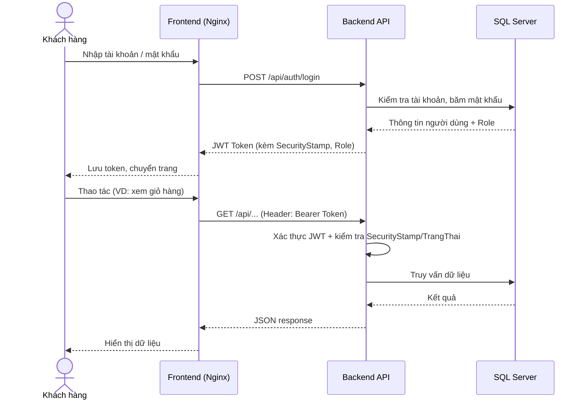
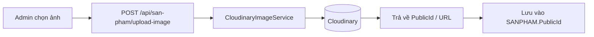

<div align="center">

# 🛋️ Cửa Hàng Nội Thất Hiện Đại

### Hệ thống quản lý cửa hàng bán nội thất trực tuyến 


[](https://dotnet.microsoft.com/)
[](https://www.microsoft.com/sql-server)
[](https://www.docker.com/)
[](#)
[](#-license)

</div>

---

## 📑 Mục lục

- [1. Giới thiệu](#1-giới-thiệu)
- [2. Thành viên](#2-thành-viên)
- [3. Công nghệ sử dụng](#3-công-nghệ-sử-dụng)
- [4. Kiến trúc hệ thống](#4-kiến-trúc-hệ-thống)
- [5. Chức năng](#5-chức-năng)
- [6. Cấu trúc thư mục](#6-cấu-trúc-thư-mục)
- [7. Database](#7-database)
- [8. API](#8-api)
- [9. Luồng hoạt động](#9-luồng-hoạt-động)
- [10. Cài đặt](#10-cài-đặt)
- [11. Cấu hình môi trường](#11-cấu-hình-môi-trường)
- [12. Hướng dẫn chạy](#12-hướng-dẫn-chạy)
- [13. Tài khoản demo](#13-tài-khoản-demo)
- [14. Hình ảnh minh họa](#14-hình-ảnh-minh-họa)
- [15. Những tính năng nổi bật](#15-những-tính-năng-nổi-bật)
- [16. Khó khăn và hướng phát triển](#16-khó-khăn-và-hướng-phát-triển)

---

## 1. Giới thiệu

**Cửa Hàng Nội Thất Hiện Đại** là hệ thống quản lý bán hàng nội thất trực tuyến, được xây dựng theo mô hình **3 tác nhân**: Khách hàng, Nhân viên bán hàng và Quản trị hệ thống, phục vụ đồng thời hai nhu cầu:

- 🛒 **Mua sắm trực tuyến**: khách hàng duyệt sản phẩm, đặt hàng, theo dõi đơn hàng.
- 🖥️ **Vận hành cửa hàng**: nhân viên/admin quản lý sản phẩm, đơn hàng, khách hàng, nhà cung cấp, vật liệu ngay trên một bảng điều khiển tập trung.

> Đây là đồ án môn học **Công nghệ phần mềm (CNPM)**, minh họa quy trình xây dựng một ứng dụng web full-stack hoàn chỉnh: từ thiết kế CSDL (CDM/PDM), API RESTful có xác thực JWT, tích hợp dịch vụ bên thứ ba (Google OAuth, Cloudinary, SMTP), cho đến triển khai bằng Docker.

**Đối tượng sử dụng:**

| Tác nhân | Mô tả |
|---|---|
| 👤 Khách hàng | Người dùng cuối, mua sắm và theo dõi đơn hàng của chính mình |
| 🧑‍💼 Nhân viên bán hàng | Xử lý đơn hàng, tra cứu thông tin khách hàng/nhà cung cấp |
| 🛠️ Quản trị hệ thống | Toàn quyền quản lý danh mục, nhân sự, phân quyền |

**Lợi ích:** số hóa quy trình bán hàng nội thất truyền thống, giảm sai sót nhập liệu, tập trung dữ liệu tồn kho — đơn hàng — khách hàng vào một hệ thống duy nhất, hỗ trợ nhiều vai trò truy cập với mức phân quyền khác nhau.

---

## 2. Thành viên

| MSSV | Họ tên | Lớp | 
|---|---|---|
| _110123235_ | Huỳnh Thiên Sơn | _DA23TTA_ |
| _110123036_ | Nguyễn An Ninh | _DA23TTA_ |
| _110123044_ | Nguyễn Duy Tân | _DA23TTA_ | 


---

## 3. Công nghệ sử dụng

### Backend

| Công nghệ | Phiên bản | Mục đích |
|---|---|---|
| ASP.NET Core Web API | .NET 9.0 | Xây dựng RESTful API |
| Entity Framework Core | 9.0.0 | ORM, truy vấn & migrate CSDL |
| Microsoft.AspNetCore.Authentication.JwtBearer | 9.0.0 | Xác thực JWT |
| Swashbuckle.AspNetCore (Swagger) | 7.0.0 | Sinh tài liệu & test API |

### Frontend

| Công nghệ | Mục đích |
|---|---|
| HTML5 / CSS3 | Giao diện storefront & trang quản trị |
| JavaScript (Vanilla, ES6+) | Xử lý logic phía client, gọi API bằng `fetch` |
| Nginx (Alpine) | Web server phục vụ file tĩnh khi chạy Docker |

### Database

| Công nghệ | Mục đích |
|---|---|
| Microsoft SQL Server 2022 | Hệ quản trị CSDL chính (database `HTQLCHBNT`) |
| PowerDesigner (CDM/PDM) | Thiết kế mô hình dữ liệu |

### Authentication

| Công nghệ | Mục đích |
|---|---|
| JWT Bearer Token | Xác thực & phân quyền theo Role |
| ASP.NET Core Identity `PasswordHasher` | Băm mật khẩu |
| Google.Apis.Auth | Đăng nhập bằng Google (OAuth 2.0) |
| Cơ chế `SecurityStamp` | Thu hồi token cũ ngay khi đổi/khôi phục mật khẩu hoặc khóa tài khoản |

### Cloud

| Công nghệ | Mục đích |
|---|---|
| CloudinaryDotNet | Lưu trữ & quản lý hình ảnh sản phẩm |

### API

| Công nghệ | Mục đích |
|---|---|
| ASP.NET Core Controllers (REST) | Cung cấp API cho Frontend |
| Swagger UI | `/swagger` — khám phá & thử API khi chạy Development |

### Version Control

| Công nghệ | Mục đích |
|---|---|
| Git & GitHub | Quản lý mã nguồn, làm việc nhóm |

### Other Tools

| Công nghệ | Mục đích |
|---|---|
| Docker & Docker Compose | Đóng gói & triển khai toàn bộ hệ thống (DB, Backend, Frontend) |
| SMTP (Gmail) | Gửi email quên mật khẩu |

---

## 4. Kiến trúc hệ thống

Hệ thống theo kiến trúc **3 lớp (3-tier)**, đóng gói và giao tiếp qua Docker network nội bộ:

```
┌─────────────────────┐
│   Frontend (Nginx)  │   HTML / CSS / JS tĩnh — cổng 5500
└──────────┬───────────┘
           │ REST API (JWT Bearer, CORS)
           ▼
┌─────────────────────┐
│  Backend API         │   ASP.NET Core 9 — cổng 5129
│  (Controllers/       │
│   Services/DTOs)     │
└──────────┬───────────┘
     ┌──────┼───────────────┬──────────────┐
     ▼      ▼                ▼              ▼
┌─────────┐ ┌────────────┐ ┌────────────┐ ┌─────────┐
│SQL Server│ │ Cloudinary │ │Google OAuth│ │  SMTP   │
│HTQLCHBNT │ │(ảnh SP)    │ │(đăng nhập) │ │ (Gmail) │
└─────────┘ └────────────┘ └────────────┘ └─────────┘
```

- **Frontend**: các trang HTML tĩnh gọi trực tiếp Backend API bằng `fetch`, được phục vụ bởi Nginx trong container riêng.
- **Backend API**: xử lý nghiệp vụ, xác thực JWT, phân quyền theo Role (`Quản trị Hệ thống`, `NV Bán Hàng`, `Khách hàng`), giao tiếp với SQL Server qua Entity Framework Core.
- **SQL Server**: lưu trữ toàn bộ dữ liệu nghiệp vụ (sản phẩm, hóa đơn, khách hàng, nhân viên...) trong database `HTQLCHBNT`.
- **Cloudinary**: lưu trữ hình ảnh sản phẩm, tổ chức theo thư mục con ứng với từng nhóm sản phẩm.
- **Google OAuth**: xác thực đăng nhập nhanh cho khách hàng qua tài khoản Google.
- **SMTP (Gmail)**: gửi email chứa liên kết đặt lại mật khẩu.

---

## 5. Chức năng

### 👤 Khách hàng

- [x] Đăng ký tài khoản
- [x] Đăng nhập (tài khoản/mật khẩu)
- [x] Đăng nhập bằng Google
- [x] Quên mật khẩu / đặt lại mật khẩu qua email
- [x] Đổi mật khẩu
- [x] Xem trang chủ, danh sách sản phẩm, chi tiết sản phẩm
- [x] Giỏ hàng
- [x] Đặt hàng / thanh toán
- [x] Xem lịch sử & trạng thái đơn hàng của chính mình
- [x] Cập nhật thông tin cá nhân

### 🧑‍💼 Nhân viên bán hàng

- [x] Quản lý hóa đơn/đơn hàng (tạo, cập nhật, hủy đơn)
- [x] Xem thống kê sản phẩm bán chạy
- [x] Tra cứu thông tin khách hàng
- [x] Tra cứu thông tin nhà cung cấp

### 🛠️ Quản trị hệ thống

- [x] Dashboard tổng quan
- [x] Quản lý sản phẩm (CRUD, tải ảnh lên Cloudinary)
- [x] Quản lý nhóm sản phẩm
- [x] Quản lý vật liệu
- [x] Quản lý mục đích sử dụng
- [x] Quản lý nhà cung cấp
- [x] Quản lý nhân viên (tạo tài khoản, cập nhật, khóa/mở tài khoản)
- [x] Quản lý khách hàng (bao gồm xóa mềm)
- [x] Phân quyền theo vai trò (Role-based Authorization)

---

## 6. Cấu trúc thư mục

```
DOAN_CNPM/
├── Backend/                       # ASP.NET Core Web API (.NET 9)
│   ├── Controllers/                # Các API Controller (Auth, SanPham, HoaDon, ...)
│   ├── Data/                       # DbContext + Entity Models (NHANVIEN, SANPHAM, ...)
│   ├── DTOs/                       # Data Transfer Objects
│   ├── Services/                   # Business logic (Auth, Email, Cloudinary, Google, Token)
│   ├── Helpers/                    # Tiện ích dùng chung (Password Policy, Cloudinary Folder...)
│   ├── Options/                    # Cấu hình strongly-typed (CloudinaryOptions)
│   ├── Database/                   # Script khởi tạo/backup CSDL SQL Server
│   │   ├── SqlCNPM.sql              # Script tạo DB + dữ liệu mẫu
│   │   ├── restore-db.sql           # Script phục hồi từ file .bak
│   │   └── init-db.sh               # Script khởi tạo DB khi chạy Docker
│   ├── Program.cs                  # Điểm khởi động, cấu hình DI/JWT/CORS
│   ├── appsettings.json            # Cấu hình ứng dụng
│   └── Dockerfile
├── Frontend/                       # Giao diện tĩnh
│   ├── html/                       # Các trang (storefront + trang quản trị)
│   ├── css/                        # Stylesheet theo từng trang
│   ├── js/                         # Logic gọi API theo từng trang
│   ├── img/                        # Hình ảnh tĩnh
│   └── nginx.conf                  # Cấu hình Nginx khi chạy Docker
├── docker-compose.yml              # Điều phối SQL Server + Backend + Frontend
├── .env.example                    # Mẫu biến môi trường cho Docker Compose
└── README.md
```

- **`Backend/Controllers`**: mỗi controller tương ứng một nhóm tài nguyên nghiệp vụ (`AuthController`, `SanPhamController`, `HoaDonController`, `KhachHangController`, `NhanVienController`, `NhomSanPhamController`, `VatLieuController`, `MucDichSuDungController`, `NhaCungCapController`).
- **`Backend/Data`**: DbContext (`AppDbContext`) và các entity ánh xạ 1-1 với bảng SQL Server.
- **`Backend/Services`**: chứa logic nghiệp vụ tách khỏi controller (xác thực, sinh JWT, gửi email, upload Cloudinary, xác minh Google token).
- **`Frontend/html|css|js`**: tổ chức song song theo tên trang — mỗi trang có bộ ba HTML/CSS/JS riêng, không dùng framework SPA.

---

## 7. Database

- **Hệ quản trị**: Microsoft SQL Server 2022, database `HTQLCHBNT`.
- **Thiết kế**: mô hình CDM (Conceptual Data Model) — xem thiết kế trong PowerDesigner đi kèm đồ án — sinh ra PDM và script `Backend/Database/SqlCNPM.sql`.
- **Số lượng bảng chính**: 10 bảng nghiệp vụ.

**Các bảng chính:**

| Bảng | Mô tả |
|---|---|
| `NHANVIEN` | Tài khoản nhân viên (Admin / NV Bán Hàng) |
| `KHACHHANG` | Tài khoản khách hàng |
| `SANPHAM` | Sản phẩm nội thất |
| `NHOMSANPHAM` | Nhóm/danh mục sản phẩm |
| `VATLIEU` | Vật liệu cấu thành sản phẩm (quan hệ n-n qua `LAMNEN`) |
| `NHACUNGCAP` | Nhà cung cấp (quan hệ n-n qua `CUNGCAP`) |
| `MUCDICHSUDUNG` | Mục đích sử dụng của sản phẩm |
| `HOADON` | Hóa đơn/đơn hàng |
| `CHITIETHOADON` | Chi tiết từng dòng sản phẩm trong hóa đơn |
| `PASSWORDRESETTOKEN` | Token dùng cho luồng quên mật khẩu |

**Quan hệ đáng chú ý:**

- `SANPHAM` — `NHOMSANPHAM`: nhiều-1 (một nhóm chứa nhiều sản phẩm).
- `SANPHAM` — `MUCDICHSUDUNG`: nhiều-1.
- `SANPHAM` — `VATLIEU`: nhiều-nhiều qua bảng `LAMNEN`.
- `SANPHAM` — `NHACUNGCAP`: nhiều-nhiều qua bảng `CUNGCAP`.
- `HOADON` — `NHANVIEN`, `HOADON` — `KHACHHANG`: nhiều-1.
- `HOADON` — `CHITIETHOADON` — `SANPHAM`: chi tiết hóa đơn liên kết hóa đơn với từng sản phẩm.
- `PASSWORDRESETTOKEN` liên kết tùy chọn tới `NHANVIEN` hoặc `KHACHHANG` thông qua cặp `UserType`/`UserId`.

> 📎 ERD/CDM/PDM chi tiết: xem file thiết kế PowerDesigner đính kèm đồ án (không nằm trong thư mục mã nguồn này).

---

## 8. API

Toàn bộ API đặt tiền tố `/api`, được bảo vệ bằng JWT Bearer Token (trừ đăng nhập/đăng ký), phân quyền theo Role qua thuộc tính `[Authorize]`.

| Nhóm API | Mô tả |
|---|---|
| `/api/auth` | Đăng ký, đăng nhập, đăng nhập Google, quên/đặt lại/đổi mật khẩu |
| `/api/san-pham` | CRUD sản phẩm, tải ảnh lên Cloudinary |
| `/api/hoa-don` | Quản lý hóa đơn, thống kê sản phẩm bán chạy, hủy hóa đơn |
| `/api/khach-hang` | CRUD khách hàng, thông tin cá nhân (`/me`) |
| `/api/nhan-vien` | CRUD nhân viên, cập nhật hồ sơ cá nhân |
| `/api/nhom-san-pham` | CRUD nhóm sản phẩm |
| `/api/vat-lieu` | CRUD vật liệu |
| `/api/muc-dich-su-dung` | CRUD mục đích sử dụng |
| `/api/nha-cung-cap` | CRUD nhà cung cấp |

> 📖 Tài liệu chi tiết từng endpoint được sinh tự động bởi **Swagger UI** tại `http://localhost:5129/swagger` khi chạy ở môi trường Development.

---

## 9. Luồng hoạt động

**Luồng đăng nhập & gọi API có xác thực:**



**Luồng tải ảnh sản phẩm lên Cloudinary:**



---

## 10. Cài đặt

### Yêu cầu

- [Docker Desktop](https://www.docker.com/products/docker-desktop/) (khuyến nghị — không cần cài .NET SDK hay SQL Server thủ công)
- Git

### Các bước

```bash
# 1. Clone project
git clone https://github.com/huynhson7/DOAN_CNPM.git
cd DOAN_CNPM

# 2. Tạo file cấu hình môi trường từ mẫu
cp .env.example .env
```

Mở file `.env` vừa tạo và chỉnh nếu cần:

```env
SA_PASSWORD=YourStrong@Passw0rd
USE_BACKUP=true
```

> `USE_BACKUP=false` sẽ khởi tạo CSDL mới kèm dữ liệu mẫu từ `Backend/Database/SqlCNPM.sql` (khuyến nghị cho lần chạy đầu). `USE_BACKUP=true` sẽ phục hồi từ file backup `.bak` có sẵn.

Các cấu hình khác cần thiết lập (xem [mục 11](#11-cấu-hình-môi-trường)):

- Cloudinary (`ApiKey`, `ApiSecret`) — dùng `dotnet user-secrets` hoặc biến môi trường, **không commit vào `appsettings.json`**.
- Google OAuth Client ID.
- SMTP (email gửi mail quên mật khẩu).

---

## 11. Cấu hình môi trường

Các biến/section cần cấu hình trong `Backend/appsettings.json` (hoặc override bằng biến môi trường / user-secrets khi deploy):

| Section | Biến | Mô tả |
|---|---|---|
| `ConnectionStrings` | `DefaultConnection` | Chuỗi kết nối SQL Server |
| `Jwt` | `Key`, `Issuer`, `Audience`, `ExpireMinutes` | Cấu hình sinh & xác thực JWT |
| `Google` | `ClientId` | Client ID cho Google OAuth Login |
| `Smtp` | `Host`, `Port`, `SenderEmail`, `SenderAppPassword`, `SenderDisplayName` | Cấu hình gửi email (App Password của Gmail) |
| `Frontend` | `BaseUrl`, `AllowedOrigins` | URL Frontend, danh sách domain được phép gọi CORS |
| `Cloudinary` | `CloudName`, `ApiKey`, `ApiSecret`, `RootFolder` | Cấu hình lưu trữ ảnh (ApiSecret nên đặt qua User Secrets) |

Biến môi trường cho Docker Compose (`.env`, không commit — đã có trong `.gitignore`):

| Biến | Mô tả |
|---|---|
| `SA_PASSWORD` | Mật khẩu tài khoản `sa` của SQL Server trong container |
| `USE_BACKUP` | `true`: phục hồi từ `.bak` — `false`: khởi tạo DB mới từ script mẫu |

> ⚠️ Không commit giá trị thật của `ApiSecret`, `SenderAppPassword`, `Jwt:Key` lên Git. Repository mẫu đi kèm giá trị demo chỉ phục vụ mục đích học tập/local.

---

## 12. Hướng dẫn chạy

### Cách 1 — Chạy bằng Docker Compose (khuyến nghị)

```bash
# Bước 1: Mở Docker Desktop trước
# Bước 2: Tại thư mục gốc dự án (đã có .env)
docker compose up -d --build

# Kiểm tra trạng thái các container
docker compose ps
```

Sau khi khởi động xong, truy cập:

| Dịch vụ | URL |
|---|---|
| 🌐 Frontend | http://localhost:5500 |
| 🔌 Backend API / Swagger | http://localhost:5129/swagger |
| 🗄️ SQL Server | `localhost,1433` (SSMS/Azure Data Studio) |

Dừng hệ thống:

```bash
docker compose down
```

### Cách 2 — Chạy thủ công (không dùng Docker)

```bash
# 1. Restore package cho Backend
cd Backend
dotnet restore

# 2. Tạo database HTQLCHBNT trên SQL Server local
#    và chạy script Backend/Database/SqlCNPM.sql

# 3. Cập nhật appsettings.json:
#    - ConnectionStrings:DefaultConnection trỏ về SQL Server local
#    - Cấu hình Cloudinary / Google / Smtp

# 4. Chạy Backend
dotnet run
# Backend chạy tại http://localhost:5129

# 5. Chạy Frontend bằng bất kỳ static server nào, ví dụ Live Server (VS Code)
#    tại cổng 5500 để khớp với CORS đã cấu hình sẵn (Frontend:AllowedOrigins)
```

---

## 13. Tài khoản demo

> Dữ liệu mẫu được nạp sẵn khi chạy `SqlCNPM.sql` (`USE_BACKUP=false`). Mật khẩu thật vui lòng tham khảo dữ liệu mẫu hoặc liên hệ nhóm phát triển — không công khai tại đây.

| Vai trò | Tài khoản đăng nhập |Mật khẩu|
|---|---|---|
| 🛠️ Quản trị Hệ thống | _admin_son_ | _123456_ |
| 🧑‍💼 NV Bán Hàng | _sale_anh1_ | _123456@Anh_ |
| 👤 Khách hàng | _DinhPhong_ | _123456@Phong_ |

---

## 14. Hình ảnh minh họa


| Trang chủ |
|---|
|  |

| Trang sản phẩm | 
|---|
|  | 

| Chi tiết sản phẩm |
|---|
|  |

---

## 15. Những tính năng nổi bật

- 🔐 **JWT Authentication** kết hợp cơ chế `SecurityStamp` — thu hồi token cũ **ngay lập tức** khi đổi/khôi phục mật khẩu hoặc tài khoản bị khóa, không cần chờ token hết hạn.
- 🔑 **Đăng nhập Google (OAuth 2.0)** cho khách hàng, song song với đăng nhập truyền thống.
- ☁️ **Tích hợp Cloudinary** quản lý ảnh sản phẩm theo thư mục con tương ứng từng nhóm sản phẩm.
- 🛡️ **Role-based Authorization** rõ ràng theo 3 vai trò: `Quản trị Hệ thống`, `NV Bán Hàng`, `Khách hàng`.
- 📧 **Quên mật khẩu qua email** với token có hạn sử dụng, gửi qua SMTP.
- 🐳 **Triển khai một lệnh** bằng Docker Compose: tự động khởi tạo/khôi phục CSDL, build Backend, phục vụ Frontend qua Nginx.
- 📘 **Swagger UI** tự sinh tài liệu API, tiện kiểm thử trong quá trình phát triển.
- 📱 Giao diện Frontend responsive, tối ưu cho cả desktop và di động.

---

## 16. Khó khăn và hướng phát triển

**Khó khăn trong quá trình thực hiện:**

- Thiết kế cơ chế phân quyền chi tiết cho 3 vai trò khác nhau trên cùng một tập API, tránh rò rỉ quyền (ví dụ: nhân viên xem được thông tin nhân viên khác) — đã được rà soát và khắc phục trong quá trình phát triển.
- Đồng bộ hoá giữa mô hình dữ liệu quan niệm (CDM) và cơ sở dữ liệu vật lý khi yêu cầu nghiệp vụ thay đổi qua nhiều lần (đổi tên cột, thêm bảng `PASSWORDRESETTOKEN`, thêm các cột xác thực...).
- Đảm bảo tương thích Windows/Linux khi chạy script khởi tạo CSDL trong Docker (ký tự xuống dòng CRLF/LF).

**Hướng phát triển:**

- [ ] Bổ sung thanh toán trực tuyến (VNPay/Momo).
- [ ] Thêm trang thống kê/báo cáo doanh thu trực quan hơn cho Admin.
- [ ] Viết unit test / integration test cho Backend.
- [ ] Chuyển Frontend sang một framework hiện đại (React/Vue) nếu mở rộng quy mô.
- [ ] Thêm phân trang, tìm kiếm nâng cao cho các trang quản trị danh mục.

---


<div align="center">

⭐ Nếu thấy dự án hữu ích, hãy để lại một star trên GitHub!

</div>